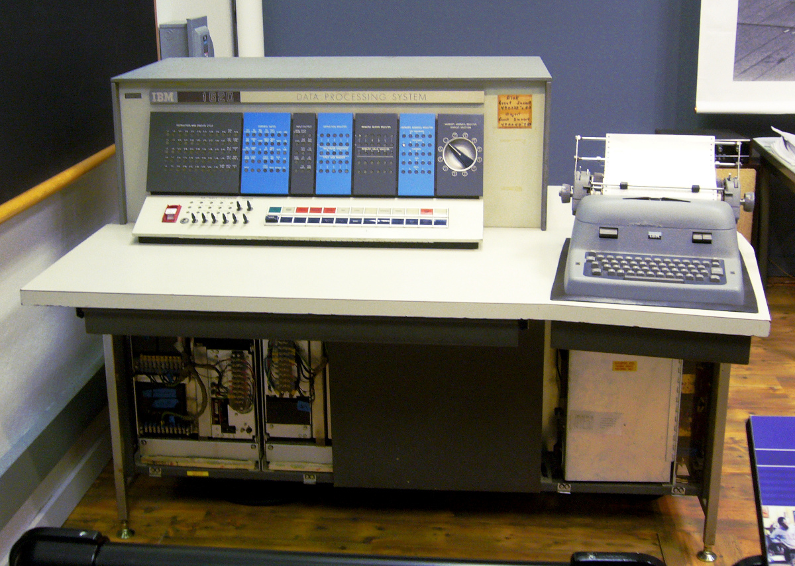
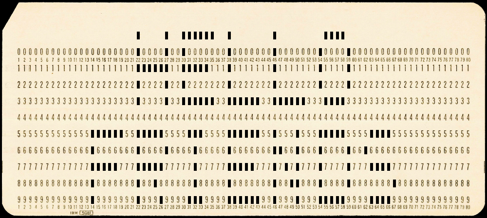

## Py1620 (IBM 1620 emulator)

This **[IBM 1620](https://en.wikipedia.org/wiki/IBM_1620) emulator in Python** can now run the famous IBM 1620 baseball game. Also included are the [Computer History Museum](https://computerhistory.org/)'s [Power of Two](https://github.com/IBM-1620/Junior/blob/master/diagnostics/binaries/APP_Power_Of_2.cmem) demo program, 2D tic-tac-toe from the 1620 General Program Library, and "99 Bottles of Beer" by Chuck Guzis among others. This README demonstrates various games and demo programs for the 1620 and also shows how to run Fortran, GOTRAN, and assembly programs.

The emulated machine is an **IBM 1620 Model 1 with 20,000 decimal digits of memory plus the optional divide instructions**. Other special features (such as indirect addressing or floating point instructions) are not supported. The addition and multiplication tables in 1620 memory are not used but standard Python integer math. **Input and output are done via punch cards (= text files) and the typewriter (= terminal).**

Also see my [IBM1620-Baseball](https://github.com/mdoege/IBM1620-Baseball) repo for additional IBM 1620 tools and documentation.

### Emulator usage

#### Running the emulator

```python3 py1620.py input.txt [0000] [output.txt]```

where input.txt is either a **card reader input file** in SIMH format or a CMEM core memory file, 0000 are the (optional) **sense switch settings**, and output.txt is the **card punch output file** (optional).

E.g., to run the baseball game with sense switch 3 set to on (= play only a single game):

```python3 py1620.py base.txt 0010```

To run the slot machine / one-armed bandit, playing for 50 cents (sense switch 4):

```python3 py1620.py band.txt 0001```

Without any arguments, the tic-tac-toe game is loaded.

#### Emulator options and other useful hints

* On Linux, you can make **tabular output** from the baseball and blackjack games line up properly by first setting the terminal's **tab stops** with the ```tabs``` command, e.g. ```tabs -18``` for the baseball game and ```tabs -16``` for blackjack.

* Machine **memory size** (```MSIZE```) is defined on line 40 of py1620.py. The IBM 1620 was also available with **40,000 or 60,000 digits of memory** and supported up to 100,000 digits in principle. However, some programs (like the day of the week program) will not work with memory sizes larger than 20k, therefore this remains the default. The **Fortran compiler** especially benefits from 40k digits or more, as its symbol table is limited to 200 entries on 20k systems, which is not enough to compile larger programs.

* If the ```SLOW``` parameter on line 7 of py1620.py is set to True, **terminal output speed will be limited to 10 characters per second** like a typewriter on a real IBM 1620. This setting makes sense especially for the baseball game and the 99 bottles of beer demo, because otherwise output will scroll by much too fast to read.

* Py1620 uses a **Unicode** combining character to display overbars for digits with an active flag bit. These overbars may not look all that great with some terminal fonts, e.g. they may be shifted horizontally in respect to the digit below. Switching to a **different terminal font** with better overbar support (like [GNU Unifont](https://unifoundry.com/unifont/)) will solve this issue.

#### Built-in debugger

**Pressing Ctrl-C enters the debugger**, where "h" prints help, "q" quits the emulator, and "c" (or just Return) continues emulation. When the machine halts for another reason (e.g. a halt instruction, a breakpoint, etc.), this will also trigger the debugger, with the prompt showing the reason for halting (```halt, break, step, watch, user, error```).

**Output from the help command** looks like this:
```
halt> h
    Available commands when system is halted:
      p        attach a punch card reader input file
      d        save memory dump
      e        examine memory
      s        show current sense switch settings
      t        toggle a sense switch with t1, t2, t3, t4
      i        show indicators
      m        manual mode (= single-step mode)
      a        auto mode
      g        set PC to value
      c        continue (or just press Return)
      q        quit emulator
    PC = 0; print current instruction with: e 0/12
```

**Memory dumps** need [Pillow](https://pillow.readthedocs.io) to output a PNG that shows memory contents. Dumps also inlcude ```mem.txt```, which is in the same format as a SIMH memory dump (from ```e 0/20000```) for easy diffing.

The ```DEBUG``` flag in line 6 of py1620.py enables **logging a CPU trace** to ```cmd.txt```.

### Included IBM 1620 software

#### Card decks

* band.txt: one-armed bandit / slot machine
* base.txt: baseball simulator (new)
* bbc1.txt: baseball simulator (old)
* beer.txt: 99 Bottles of Beer demo (2005)
* black.txt: blackjack game
* block.txt: punch block letter messages into punch cards
* cal.txt: day of the week calculator
* gotran.txt: the GOTRAN interactive programming language
* hello.txt: Hello World assembly demo; assembled binary from hello.sps
* pdq.txt: PDQ Fortran compiler
* pdq-fixed.txt: PDQ Fortran compiler subroutines (fixed format)
* pdq-free.txt: PDQ Fortran compiler subroutines (free format)
* sps.txt: Symbolic Programming System (assembler)
* test.txt: Fortran demo; compiled binary from test.f
* tic3d.txt: 3D tic-tac-toe on a 4x4x4 grid
* tic.txt: normal 3x3 tic-tac-toe

#### Core memory files

* APP_Power_Of_2.cmem: power of 2 demo program from the Computer History Museum, originally programmed in 2005 when they restored an IBM 1620 and exhibited it in the museum
* CU01.cmem: IBM diagnostic to test if CPU instructions work properly. Originally intended for finding hardware faults on a real IBM 1620, but also useful now for testing the accuracy of emulators such as this one.

#### Source code

* gotran_input.txt: GOTRAN
* hello.sps: assembly
* test.f: Fortran
* pi.f: Fortran

#### Rosetta Code examples

The ```rosetta_code/``` directory contains four assembly programs which were created for [Rosetta Code](https://rosettacode.org/wiki/Category:IBM_1620_SPS): **a cellular automaton, Fibonacci numbers, FizzBuzz, and the Mandelbrot set**. Except for the Mandelbrot set (which requires floating-point instructions), all programs work in Py1620.

Assembly was done with [SPS1620](https://github.com/IBM-1620/SPS1620), a Java-based cross-assembler, to create the CRD/CMEM/LST output files.

The TXT files on the other hand have been assembled in Py1620 with the SPS assembler. The main difference is that the TXT binaries will halt after loading.

### Why emulate the IBM 1620?

The **decimal-based IBM 1620** (codename CADET) computer was intended for science and engineering applications and was, like its business-oriented counterpart the IBM 1401 (codename SPACE), part of IBM's late 1950s effort to produce **smaller, more affordable computers** using the latest technology (core memory, transistors) that would appeal to budget-conscious first-time buyers such as **Universities and mid-size business**. Both computers were announced in 1959, were very successful in their respective niches and were often in use into the early 1970s. They were also kept alive by **emulation**, as IBM 360-type mainframes supported emulating them.

In practice, the **1620 feels similar in some ways to an early DEC PDP** such as the PDP-8, but also opposite in other aspects, which makes it an interesting target for emulation. Both the 1620 and the PDP-8 could be considered early personal computers, apart from their high price tags and more limited production runs.

**Similarities between the 1620 and a PDP-8 include**: They are friendly minicomputers, not too expensive (by the standards of the day), ideal for interactive use and games. Their basic operation is quite simple, with just the computer, a terminal (teletype/typewriter), and input/output via paper media required. Magnetic storage media were supported but optional for most software (making it easier to write an emulator for these machines). An operating system is not needed; most programs run on bare metal.

But in many ways the **1620 and a PDP are also very different**: punch cards (1620) vs paper tape (PDP), variable-length decimal (1620) vs binary words (PDP), a machine language that is high-level (1620) vs one that is extremely low-level (PDP-8), and booting the machine automatically from punch cards (1620) vs toggling in a paper tape loader via the front panel (PDP).

The main reasons why the **1620 is relatively obscure today** compared to the more ubiquitous DEC PDP are probably that fewer 1620s were built, that they were more expensive, and that IBM customers typically rented their machines rather than purchased them, therefore fewer 1620s still exist today.

A major **advantage of the 1620 for emulation** is that a lot of software for the system has survived on punch cards, mainly from Bitsavers and the CHM collection, and that it includes quite a few games and interactive demos. This is helpful when writing an emulator, because programs of different complexity which exercise the machine in different ways are ideal for testing.

**Decimal computers with variable-length data words** like the 1620 are also interesting because their operation corresponds more closely to a **Turing machine** than binary computers with a fixed word size: E.g. a Turing machine can add two decimal numbers which are next to each other on the tape by performing addition digit by digit. (There are online Turing machine simulators that demonstrate this kind of program.) The 1620 also works digit by digit and—since it has no adder—it even uses a lookup table (somewhat like a state transition table in a Turing machine) to perform addition and multiplication. When the 1620 is running a program, it spends a lot of its time either searching left until it finds a flag bit on the high digit of a number or searching left or right until it hits a record mark, therefore the **(at least vague) similarity to a Turing machine** is pretty clear.



### Power of 2 demo program from the Computer History Museum


The program is loaded from the CMEM file. Computing 2**9999 takes about 35 seconds on a PC, so this particular program is about 35x as fast in Py1620 as on a real IBM 1620.

Also see this [YouTube video](https://www.youtube.com/watch?v=e4JH26yF_u0) of Power of Two running on the [1620 Junior](https://github.com/IBM-1620) emulator.

```
$ python3 py1620.py APP_Power_Of_2.cmem

POWER OF 2 CALCULATOR

N = 8

2**8 = 256


N = 100

2**100 = 1267650600228229401496703205376
```

### Tic-tac-toe (default program)

The program is loaded from the punch card text file. When the computer loses, it will learn the losing move and play differently next time:


```
$ python3 py1620.py

*** HALT at 0; press Return to continue; enter 'h' for help or 'q' to quit
halt> 

SQUARES NUMBERED AS FOLLOWS

1  2  3

4  5  6

7  8  9

SW 1 ON FOR DATA,PUSH START
*** HALT at 1350; press Return to continue; enter 'h' for help or 'q' to quit
halt> 

NEW GAME
YOUR PLAY 5
   MY PLAY IS 1
YOUR PLAY 2
   MY PLAY IS 8
YOUR PLAY 9
   MY PLAY IS 3
YOUR PLAY 6
   MY PLAY IS 4
YOUR PLAY 7
 TIE GAME
NEW GAME
YOUR PLAY 
```

### 3D tic-tac-toe (Fortran)

[3D tic-tac-toe](https://en.wikipedia.org/wiki/3D_tic-tac-toe) game by Bob Louden (1962) on a 4x4x4 grid. Requires the IBM 1620 LD and D divide instructions. The (physical) game was also released by Parker Brothers under the name Qubic in 1964.

```
$ python3 py1620.py tic3d.txt 

LOAD DATA
*** HALT at 4; press Return to continue; enter 'h' for help or 'q' to quit
halt> 

 
GOOD MORNING, SIR, MADAM OR MISS 
(I CAN HARDLY TELL FROM IN HERE) 
WE ARE GOING TO PLAY TIC-TAC-TOE 
IF YOU KNOW HOW WE CAN BEGIN.
IF YOU WANT ME TO EXPLAIN FIRST, 
RAISE PROGRAM SWITCH 1.
NOW PUSH START.
 
*** HALT at 9508; press Return to continue; enter 'h' for help or 'q' to quit
halt> t1
sense switches now: 1000
halt> 

 
THIS GAME IS TYPICAL OF WHAT YOU 
CAN ACCOMPLISH USING THE 1620
IF YOU HAVE NOTHING BETTER TO DO 
THE GAME IS PLAYED ON 4 LEVELS
EACH LEVEL IS A 4X4 GRID
THE OBJECT IS TO GET 4 IN A ROW
THE LEVELS ARE ABOVE EACH OTHER
AND WINNING ROWS MAY BE SET UP
IN ANY DIRECTION.
YOU AND I WILL TAKE TURNS MOVING 
 
TO TELL ME WHERE YOU HAVE MOVED, 
JUST TYPE A 3-DIGIT NUMBER.
FOR EXAMPLE, 243 WOULD MEAN
2ND LEVEL, 4TH ROW, 3RD COLUMN.
 
TO RESTART IN CASE OF TIES,
RAISE SWITCH 3, RELEASE, START.
TO CORRECT A TYPING ERROR,
RAISE SWITCH 4, RELEASE, START.
 
YOU MAY DRAW THE GAME ON PAPER.
I KEEP TRACK IN MY HEAD.....
BOB LOUDEN, IBM, FEBRUARY, 1962. 
 
RAISE SWITCH 2 TO MOVE FIRST.
OTHERWISE I WILL. TYPE YOUR NAME 
RELEASE AND START.
 
martin

 111 IS MY MOVE 
TYPE YOUR MOVE, RELEASE, START.
212

 444 IS MY MOVE 
TYPE YOUR MOVE, RELEASE, START.
213

 114 IS MY MOVE 
TYPE YOUR MOVE, RELEASE, START.
214

GOOD TRY THERE,
MARTIN               
 211 IS MY MOVE 
TYPE YOUR MOVE, RELEASE, START.
311

 112 IS MY MOVE 
TYPE YOUR MOVE, RELEASE, START.
321

MARTIN               
I WIN ON THE FOLLOWING SEQUENCE
 112 
 113 
 114 
 111 
 
RAISE SWITCH 2 TO MOVE FIRST.
PLEASE TYPE YOUR NAME.
THEN RELEASE AND START.
```

### One-armed bandit (aka slot machine)

Setting all sense switches to off (with "t4" in the debugger in the run below) prints your account balance and resets the account to zero:
```
$ python3 py1620.py band.txt 0001

TYPE A 10-DIGIT NUMBER, THEN HIT RELEASE + START.
1234512345


HERE ARE THE PAYOFFS. . .
Ж  Ж  Ж    PAYS THE JACKPOT. . .  YOU WIN A 1620.
$  $  $    PAYS 20 TO 1,
X  X  X    PAYS 12 TO 1,
Ж  Ж  X    PAYS  8 TO 1,
$  $  X    PAYS  5 TO 1,
Ж  X  X    PAYS  2 TO 1, AND
$  X  X    PAYS  1 TO 1.
     X REPRESENTS ANY SYMBOL OTHER THAN Ж OR $.

TO PLAY FOR NICKELS, TURN ON SWITCH 1.
TO PLAY FOR DIMES, TURN ON SWITCH 2.
TO PLAY FOR QUARTERS, TURN ON SWITCH 3.
TO PLAY FOR HALVES, TURN ON SWITCH 4.

TO CHANGE PLAYERS AT ANY TIME, TURN ALL SWITCHES OFF AND HIT START.

TO SPIN THE WHEELS, PUSH START WITH GREAT VIGOR.

*** HALT at 1838; press Return to continue; enter 'h' for help or 'q' to quit
halt> 
=   Ж   Ж

*** HALT at 1838; press Return to continue; enter 'h' for help or 'q' to quit
halt> 
+   Ж   @

*** HALT at 1838; press Return to continue; enter 'h' for help or 'q' to quit
halt> 
*   *   *	YOU WIN  $6.00

*** HALT at 1838; press Return to continue; enter 'h' for help or 'q' to quit
halt> 
+   @   =

*** HALT at 1838; press Return to continue; enter 'h' for help or 'q' to quit
halt> 
*   @   *

*** HALT at 1838; press Return to continue; enter 'h' for help or 'q' to quit
halt> 
@   =   +

*** HALT at 1838; press Return to continue; enter 'h' for help or 'q' to quit
halt> 
$   $   =	YOU WIN  $2.50

*** HALT at 1838; press Return to continue; enter 'h' for help or 'q' to quit
halt> t4
sense switches now: 0000
halt> 

YOU WON $5.00

CHECK SWITCHES FOR YOUR BET.
TO SPIN THE WHEELS, PUSH START WITH GREAT VIGOR.


*** HALT at 1838; press Return to continue; enter 'h' for help or 'q' to quit
halt> 
```

### Blackjack

After the program has explained the sense switch settings, it will enter an infinite loop. Press Ctrl-C to start the debugger, then toggle sense switch 1 and continue. This will begin the game.

This game is very similar to the [blackjack game by Mel Kaye](https://datatravelandexperiments.com/kps/sw/lgp/) (famous for "[The Story of Mel](https://en.wikipedia.org/wiki/The_Story_of_Mel)") for the [LGP-30](https://en.wikipedia.org/wiki/LGP-30). Both games also use the five-card rule (or five-card trick), so the player always wins if he has five cards (or more).

The player's cards are in the left column; the computer's in the right column. On Linux, the program's output can be improved with the ```tabs``` command, e.g. ```tabs -16``` sets the terminal to 16-character-wide tab stops that work well with this game.
```
$ python3 py1620.py black.txt 

*** HALT at 0; press Return to continue; enter 'h' for help or 'q' to quit
halt> 

BLACKJACK GAME 08-1-64

CLEAR ALL TYPEWRITER TAB STOPS.
*** HALT at 486; press Return to continue; enter 'h' for help or 'q' to quit
halt> 

SET TABS AT FOLLOWING STOP POINTS.
               
*** HALT at 546; press Return to continue; enter 'h' for help or 'q' to quit
halt> 
               
*** HALT at 570; press Return to continue; enter 'h' for help or 'q' to quit
halt> 
               
*** HALT at 594; press Return to continue; enter 'h' for help or 'q' to quit
halt> 

SW1 MUST BE,OFF INITIALLY.
TO START GAME.
SW2 OFF-AUTOMATIC SHUFFLE AT END OF DECK.,SW2  ON-SHUFFLE CARDS BEFORE EACH HAND.
SW2  ON-SHUFFLE CARDS BEFORE EACH HAND.
SW3  ON-INITIALIZE TO START NEW GAME.
SW4  ON-ENTRY ERROR.
SET SENSE SWITCHES,,THEN PUSH START.
*** HALT at 774; press Return to continue; enter 'h' for help or 'q' to quit
halt> 


^C
*** system halted by user at PC = 4372 ; enter 'q' to quit
user> t1
sense switches now: 1000
user> 

                 K-S
                 J-C             5-S
CARD-no
                                 A-S
                                10-H
                                 9-D
                TOTAL = 20      BUST            SCORE = +$1.00


                 7-H
                 Q-S             9-S
CARD-no
                                 3-C
                                 K-H
                TOTAL = 17      BUST            SCORE = +$2.00


                 6-H
                10-S             9-C
CARD-yes
                 8-C             6-S
                BUST            TOTAL = 15      SCORE = +$1.00


                 3-S
                 5-C             J-S
CARD-yes
                 A-C
CARD-no
                                10-C
                TOTAL = 19      TOTAL = 20      SCORE =  $0.00


                 3-H
                 5-D             4-S
CARD-yes
                 4-H
CARD-yes
                 5-H
CARD-yes
                 A-D
CARD-no
                                 7-S
                5 CARDS         TOTAL = 11      SCORE = +$2.00


                 Q-H
                 6-D             7-C
CARD-
```

### 99 Bottles of Beer

```
$ python3 py1620.py beer.txt 

*** HALT at 0; press Return to continue; enter 'h' for help or 'q' to quit
halt> 

99 BOTTLES OF BEER ON THE WALL.
99 BOTTLES OF BEER.
TAKE ONE DOWN, PASS IT AROUND -
98 BOTTLES OF BEER ON THE WALL.

98 BOTTLES OF BEER ON THE WALL.
98 BOTTLES OF BEER.
TAKE ONE DOWN, PASS IT AROUND -
97 BOTTLES OF BEER ON THE WALL.

97 BOTTLES OF BEER ON THE WALL.
97 BOTTLES OF BEER.
TAKE ONE DOWN, PASS IT AROUND -
96 BOTTLES OF BEER ON THE WALL.

96 BOTTLES OF BEER ON THE WALL.
96 BOTTLES OF BEER.
TAKE ONE DOWN, PASS IT AROUND -
95 BOTTLES OF BEER ON THE WALL.

95 BOTTLES OF BEER ON THE WALL.
95 BOTTLES OF BEER.
TAKE ONE DOWN, PASS IT AROUND -
94 BOTTLES OF BEER ON THE WALL.

…………………and many beers later:

3 BOTTLES OF BEER ON THE WALL.
3 BOTTLES OF BEER.
TAKE ONE DOWN, PASS IT AROUND -
2 BOTTLES OF BEER ON THE WALL.

2 BOTTLES OF BEER ON THE WALL.
2 BOTTLES OF BEER.
TAKE ONE DOWN, PASS IT AROUND -
1 BOTTLE OF BEER ON THE WALL.

1 BOTTLE OF BEER ON THE WALL.
1 BOTTLE OF BEER.
TAKE ONE DOWN, PASS IT AROUND -
NO MORE BEER.

*** HALT at 606; press Return to continue; enter 'h' for help or 'q' to quit
halt> 
```

### Block letters on punch cards

The block.txt program outputs block letters on punch cards, with either one or two lines of text on a card and up to 10 characters per line.

Each card is fed into the punch six times: 3x the normal way to print the upper half; then 3x flipped and rotated to print the lower half. When setting the number of cards to 1, this will produce a six-line output file from the emulator.

#### One line of text

```
$ python3 py1620.py block.txt 0000 output1.txt

*** HALT at 0; press Return to continue; enter 'h' for help or 'q' to quit
halt> 

SET CENTERING SWITCHES BEFORE TYPING EACH LINE
SW1 ON-NO UPPER CENTERING	SW2 ON-NO LOWER CENTERING
TEN CHARACTER LIMIT PER LINE

NO. OF 2-LINE SETS-0
	NO. OF 1-LINE SETS-1


1-LINE SETS-
SET NO. 01	FIRST LINE-hello

NO. OF CARDS-1


LOAD 003 CARDS(12-EDGE 1ST, FACE UP)
RELOAD SAME WAY-PUSH START
*** HALT at 15716; press Return to continue; enter 'h' for help or 'q' to quit
halt> 

RELOAD SAME WAY-PUSH START
*** HALT at 15716; press Return to continue; enter 'h' for help or 'q' to quit
halt> 


FLIP CARDS(PUT 9-EDGE 1ST, FACE DOWN)-PUSH START
*** HALT at 15716; press Return to continue; enter 'h' for help or 'q' to quit
halt> 

RELOAD SAME WAY-PUSH START
*** HALT at 15716; press Return to continue; enter 'h' for help or 'q' to quit
halt> 

RELOAD SAME WAY-PUSH START
*** HALT at 15716; press Return to continue; enter 'h' for help or 'q' to quit
halt> 


PUNCHING COMPLETE-PUSH START
*** HALT at 15908; press Return to continue; enter 'h' for help or 'q' to quit
halt> 
```

The program block_decode.py can then be used to show what the finished card would look like:

```
$ python3 block_decode.py output1.txt 
................................................................................
.....................**...**.*******.**......**.......*****.....................
.....................**...**.**......**......**......**...**....................
.....................**...**.**......**......**......**...**....................
.....................**...**.**......**......**......**...**....................
.....................*******.*****...**......**......**...**....................
.....................*******.*****...**......**......**...**....................
.....................**...**.**......**......**......**...**....................
.....................**...**.**......**......**......**...**....................
.....................**...**.**......**......**......**...**....................
.....................**...**.*******.*******.*******..*****.....................
................................................................................
```

#### Two lines of text

```
$ python3 py1620.py block.txt 0000 output2.txt

*** HALT at 0; press Return to continue; enter 'h' for help or 'q' to quit
halt> 

SET CENTERING SWITCHES BEFORE TYPING EACH LINE
SW1 ON-NO UPPER CENTERING	SW2 ON-NO LOWER CENTERING
TEN CHARACTER LIMIT PER LINE

NO. OF 2-LINE SETS-1
	NO. OF 1-LINE SETS-0


2-LINE SETS-
SET NO. 01	FIRST LINE-hello
     SECOND LINE-friends

NO. OF CARDS-1


LOAD 003 CARDS(12-EDGE 1ST, FACE UP)
RELOAD SAME WAY-PUSH START
*** HALT at 15716; press Return to continue; enter 'h' for help or 'q' to quit
halt> 

RELOAD SAME WAY-PUSH START
*** HALT at 15716; press Return to continue; enter 'h' for help or 'q' to quit
halt> 


FLIP CARDS(PUT 9-EDGE 1ST, FACE DOWN)-PUSH START
*** HALT at 15716; press Return to continue; enter 'h' for help or 'q' to quit
halt> 

RELOAD SAME WAY-PUSH START
*** HALT at 15716; press Return to continue; enter 'h' for help or 'q' to quit
halt> 

RELOAD SAME WAY-PUSH START
*** HALT at 15716; press Return to continue; enter 'h' for help or 'q' to quit
halt> 


PUNCHING COMPLETE-PUSH START
*** HALT at 15908; press Return to continue; enter 'h' for help or 'q' to quit
halt> 
```

Decoding produces:

```
$ python3 block_decode.py output2.txt 
................................................................................
.....................*....*..******..*.......*........****......................
.....................*....*..*.......*.......*.......*....*.....................
.....................******..*****...*.......*.......*....*.....................
.....................*....*..*.......*.......*.......*....*.....................
.....................*....*..******..******..******...****......................
................................................................................
.............******..*****....***....******..*...*...*****....****..............
.............*.......*....*....*.....*.......**..*...*....*..*..................
.............*****...*****.....*.....*****...*.*.*...*....*...****..............
.............*.......*..*......*.....*.......*..**...*....*.......*.............
.............*.......*...*....***....******..*...*...*****....****..............
```

#### Output as PNG images

With block_decode_image.py, the output can also be converted to an image of a punch card (needs [Pillow](https://pillow.readthedocs.io)):

```
python3 block_decode_image.py output1.txt block_card1.png
python3 block_decode_image.py output2.txt block_card2.png
```




### Day of the week (programmed in Fortran)

This Fortran program calculates the day of the week for a given date.

The IBM 1620 product specifications are dated January 6, 1960. Entering this date into the program produces the correct answer that this was a Wednesday:

```
$ python3 py1620.py cal.txt 

BEGIN EXECUTION.


 GREGORIAN CALENDAR-1585 AD TO 2599 AD


 SENSE SWITCH NUMBER 1 ON FOR CARD DATA
 INPUT, OFF FOR TYPEWRITER INPUT


PAUSE 0001
*** HALT at 3576; press Return to continue; enter 'h' for help or 'q' to quit
halt> 

1 6 1960

 JANUARY    6 , 1960
 IS A WEDNESDAY
```

### GOTRAN

GOTRAN is an interactive Fortran-like programming language for the IBM 1620. A program is entered from the typewriter (or read from cards) and after a final ```END``` statement, the machine halts. Starting the machine runs the program. Then it halts again and the next program can be entered.

Here are three GOTRAN programs. The first one computes the sine for different angles, the second one the Fibonacci sequence and the golden ratio, and the third one computes the golden ratio directly:

#### Print sine table

```
$ python3 py1620.py gotran.txt 

*** HALT at 18156; press Return to continue; enter 'h' for help or 'q' to quit
halt>  
x=.3

do 1 i=1,10

a=sin(x)

print,i,x,a

1 x=x+.6

end


*** HALT at 8514; press Return to continue; enter 'h' for help or 'q' to quit
halt> 

 001	 .30000000	 .29552020	
 002	 .90000000	 .78332690	
 003	 1.5000000	 .99749498	
 004	 2.1000000	 .86320936	
 005	 2.7000000	 .42737988	
 006	 3.3000000	-.15774568	
 007	 3.9000000	-.68776615	
 008	 4.5000000	-.97753012	
 009	 5.1000000	-.92581468	
 010	 5.7000000	-.55068554	
END OF PROGRAM


*** HALT at 1842; press Return to continue; enter 'h' for help or 'q' to quit
halt> 
```

#### Fibonacci (iterative)

(continuing the GOTRAN session from the previous section)

```
a=1.

b=1.

do 1 i=3,30

c=a+b

g=c/b

print,i,c,g

a=b

1 b=c

end


*** HALT at 8514; press Return to continue; enter 'h' for help or 'q' to quit
halt> 

 003	 2.0000000	 2.0000000	
 004	 3.0000000	 1.5000000	
 005	 5.0000000	 1.6666666	
 006	 8.0000000	 1.6000000	
 007	 13.000000	 1.6250000	
 008	 21.000000	 1.6153846	
 009	 34.000000	 1.6190476	
 010	 55.000000	 1.6176470	
 011	 89.000000	 1.6181818	
 012	 144.00000	 1.6179775	
 013	 233.00000	 1.6180555	
 014	 377.00000	 1.6180257	
 015	 610.00000	 1.6180371	
 016	 987.00000	 1.6180327	
 017	 1597.0000	 1.6180344	
 018	 2584.0000	 1.6180338	
 019	 4181.0000	 1.6180340	
 020	 6765.0000	 1.6180339	
 021	 10946.000	 1.6180339	
 022	 17711.000	 1.6180339	
 023	 28657.000	 1.6180339	
 024	 46368.000	 1.6180339	
 025	 75025.000	 1.6180339	
 026	 121393.00	 1.6180339	
 027	 196418.00	 1.6180339	
 028	 317811.00	 1.6180339	
 029	 514229.00	 1.6180339	
 030	 832040.00	 1.6180339	
END OF PROGRAM


*** HALT at 1842; press Return to continue; enter 'h' for help or 'q' to quit
halt> 
```

#### Fibonacci (exact)

(continuing the GOTRAN session from the previous section)

```
a=sqr(5.)

g=1.+a

g=g/2.

print,g

end


*** HALT at 8514; press Return to continue; enter 'h' for help or 'q' to quit
halt> 

 1.6180339	
END OF PROGRAM


*** HALT at 1842; press Return to continue; enter 'h' for help or 'q' to quit
halt> 
```

#### Reading a GOTRAN program from punch cards

If sense switch 1 is set, GOTRAN will read and run programs from the punch card reader instead of the typewriter. A new card reader input file has to be attached from the debugger after GOTRAN has loaded:

```
$ python3 py1620.py gotran.txt 1000

*** HALT at 18156; press Return to continue; enter 'h' for help or 'q' to quit
halt> p gotran_input.txt
*** attaching file gotran_input.txt with 32 cards
halt> 


*** HALT at 8514; press Return to continue; enter 'h' for help or 'q' to quit
halt> 

 .00	  * HELLO FROM GOTRAN *
 .00	    * HELLO FROM GOTRAN *
 .00	      * HELLO FROM GOTRAN *
 .00	        * HELLO FROM GOTRAN *
 .00	          * HELLO FROM GOTRAN *
 .00	            * HELLO FROM GOTRAN *
 .00	          * HELLO FROM GOTRAN *
 .00	        * HELLO FROM GOTRAN *
 .00	      * HELLO FROM GOTRAN *
 .00	    * HELLO FROM GOTRAN *
 .00	  * HELLO FROM GOTRAN *
END OF PROGRAM


*** HALT at 1842; press Return to continue; enter 'h' for help or 'q' to quit
halt> 
```

### PDQ Fortran

PDQ Fortran does not need floating point instructions (unlike IBM Fortran), so it works with this emulator.

First, create a new card deck which contains the Fortran compiler, the source code to be compiled, and one of the (free or fixed format) Fortran subroutine decks. (Note that the Fortran source code should not have extra newlines at the end, as this would introduce empty cards into the deck!)

```$ cat pdq.txt test.f pdq-fixed.txt > pdq-deck.txt```

Then run that deck to compile your program and get an object deck:

```
$ python3 py1620.py pdq-deck.txt 0101 test.txt

PDQ FORTRAN C2  
START
]6600        X=0
]6636        PRINT 3
]6648   3    FORMAT (36H           X      SIN(X)      COS(X))
]6744        DO 1 I=1,10
]6756        Y=SIN(X)
]6780        Z=COS(X)
]6804        PRINT 2,X,Y,Z
]6852   2    FORMAT (3F12.6)
]6884   1    X=X+.3
]6956        END
1̅9999 SIN  
1̅9989 SINF 
1̅9979 COS  
1̅9969 COSF 
1̅9959 EXP  
1̅9949 EXPF 
1̅9939 LOG  
1̅9929 LOGF 
1̅9919 SQRT 
1̅9909 SQRTF
1̅9899 ABS  
1̅9889 ABSF 
1̅9879 DRH  
1̅9869 DRHF 
1̅9859 ATAN 
1̅9849 ATANF
1̅9839 X    
1̅9829 0̅000̅
1̅9819 0̅003
1̅9809 0̅001
1̅9799 I    
1̅9789 Y    
1̅9779 0̅00
1̅9769 Z    
1̅9759 0̅002
1̅9749 5̅030000000̅

LOAD SUBROUTINES
PDQ FIXED FMT SUBROUTNS 11/63
PROCESSING COMPLETE
*** HALT at 1864; press Return to continue; enter 'h' for help or 'q' to quit
halt> q
```

Quit the emulator and run the compiled program:

```
$ python3 py1620.py test.txt

LOAD DATA
           X      SIN(X)      COS(X)
     .000000     .000000    1.000000
     .300000     .295520     .955336
     .600000     .564642     .825335
     .900000     .783326     .621609
    1.200000     .932039     .362357
    1.500000     .997494     .070737
    1.800000     .973847    -.227202
    2.100000     .863209    -.504846
    2.400000     .675463    -.737393
    2.700000     .427379    -.904072
END
*** HALT at 2524; press Return to continue; enter 'h' for help or 'q' to quit
halt> q
```

#### Calculating π

Running this program requires setting DIV_WORKAROUND to True in Py1620.

```
$ cat pdq.txt pi.f pdq-fixed.txt > pi-deck.txt
$ python3 py1620.py pi-deck.txt 0101 pi.txt

PDQ FORTRAN C2  

START

  (…full Fortran compiler output omitted here…)

LOAD SUBROUTINES
PDQ FIXED FMT SUBROUTNS 11/63
PROCESSING COMPLETE
*** HALT at 1864; press Return to continue; enter 'h' for help or 'q' to quit
halt> q
$ python3 py1620.py pi.txt

LOAD DATA
 3.139593
 3.140594
 3.140928
 3.141096
 3.141197
 3.141265
 3.141314
 3.141351
 3.141379
 3.141403
END
*** HALT at 2524; press Return to continue; enter 'h' for help or 'q' to quit
halt>
```

### Symbolic Programming System (assembler)

Here is the assembly source file hello.sps. Labels start in column 6, mnemonics in column 12, and arguments in column 16:

```
     START WATYHELLO
           H
     HELLO DAC 12,HELLO WORLD@
           DENDSTART
```

The program prints (```WATY```) the hello string defined with ```DAC``` and then halts (```H```).  "@" is a record mark. ```DEND``` ("define end") has to be the final instruction.

This is a two-pass assembler, so the source file has to be read twice:

```
$ python3 py1620.py sps.txt 1010 hello.txt

*** HALT at 0; press Return to continue; enter 'h' for help or 'q' to quit
halt> p hello.sps
*** attaching file hello.sps with 4 cards
halt> 

END OF PASSI  
*** HALT at 12040; press Return to continue; enter 'h' for help or 'q' to quit
halt> p hello.sps
*** attaching file hello.sps with 4 cards
halt> 

     START  WATY HELLO
	00402 39 00427 00100
            H     
	00414 48 00000 00000
     HELLO  DAC  12,HELLO WORLD@
	00427 00012
            DEND START
	00402
END OF PASSII 
00402   START   00427   HELLO   
*** HALT at 12664; press Return to continue; enter 'h' for help or 'q' to quit
halt> q
```

Running the program:

```
$ python3 py1620.py hello.txt

*** HALT at 0; press Return to continue; enter 'h' for help or 'q' to quit
halt> 
HELLO WORLD
*** HALT at 414; press Return to continue; enter 'h' for help or 'q' to quit
halt> 
```

### CU01 general op codes diagnostic

Py1620 now completes this important IBM 1620 self test successfully. Tests 51 to 55 have been disabled because Py1620 does not use addition tables.

Testing takes about 5 seconds on a PC, as opposed to 150 seconds on a real IBM 1620, so it is about 30x as fast.

```
$ python3 py1620.py CU01.cmem 0000 out.txt
SW 1 OFF SW 2 OFF SW 3 OFF SW 4 OFF SET SWS FOR  CU01    THEN START
*** HALT at 1080; press Return to continue; enter 'h' for help or 'q' to quit
halt> 

START ROUTINES. ETOS FOLLOW. 
	12345  67890
	12345  67890  12345
	12345  67890
NUM INFO ABOVE OFFSET TO RIGHT TWO SPACES BETWEEN 5 AND 6 THREE LINES OF DATA

199760123456789‡1̅2̅199989
TEST ROUTINES COMPLETED. IF SW1 OFF AND NO ROUTINE NOS TYPED OUT, MACHINE PERFORMED TESTS PROPERLY.
*** HALT at 16236; press Return to continue; enter 'h' for help or 'q' to quit
halt> p out.txt
*** attaching file out.txt with 4 cards
halt> 

1997601234567891̅2̅199989
.)+$*-/,(=@ ABCDEFGHIJKLMNOPQRSTUVWXYZ0123456789
.)+$*-/,(=@ ABCDEFGHIJKLMNOPQRSTUVWXYZ0123456789
.)+$*-/,(=@ ABCDEFGHIJKLMNOPQRSTUVWXYZ0123456789

*** HALT at 16500; press Return to continue; enter 'h' for help or 'q' to quit
```

### Credits

The IBM 1403 printer font is available at [ibm-1401.info](http://ibm-1401.info/Sched2008December.html#1403-Font).

[IBM 1620 typewriter image](https://commons.wikimedia.org/wiki/File:IBM_1620_console_typewriter.mw.jpg) by Marcin Wichary, CC BY 2.0 <https://creativecommons.org/licenses/by/2.0>, via Wikimedia Commons

[IBM 1620 image](https://commons.wikimedia.org/wiki/File:Computer_History_Museum_P1020815_(313527189).jpg) by Takuya Oikawa, CC BY-SA 2.0 <https://creativecommons.org/licenses/by-sa/2.0>, via Wikimedia Commons

IBM punch card image from [Douglas W. Jones's punched card collection](https://homepage.divms.uiowa.edu/~jones/cards/collection/i-onefield.shtml).

### Further reading

* [Basic Programming Concepts and the IBM 1620 Computer](http://www.bitsavers.org/pdf/ibm/1620/Basic_Programming_Concepts_and_the_IBM_1620_Computer_1962.pdf)
* [PDQ Fortran manual](https://bitsavers.org/pdf/ibm/1620/general_program_library/2.6_031_PDQ_FORTRAN.pdf)
* [SPS manual](https://bitsavers.org/pdf/ibm/1620/C26-5600-1_Symbolic_Programming_System_Apr63.pdf)
* [Bitsavers IBM 1620 documentation](https://bitsavers.org/pdf/ibm/1620/)

